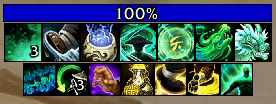
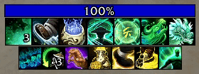

# HideGCDSweep

Hides the distracting GCD sweep animation on icons displayed by Blizzard's built-in Cooldown Manager — without touching real cooldown sweeps.

---

## Before / After

| Before | After |
|--------|-------|
|  |  |

---

## Compatibility

- **Blizzard Cooldown Manager** — the default UI included with the game
- **[Cooldown Manager Centered](https://www.curseforge.com/wow/addons/cooldown-manager-centered)** 
- **[BetterCooldownManager](https://www.curseforge.com/wow/addons/bettercooldownmanager)**

No configuration required — install and forget.

---

## What it does

Every time your Global Cooldown fires, Blizzard's Cooldown Manager icons play a brief swipe/sweep animation. When you have many abilities tracked, this creates constant visual noise on every single GCD.

**HideGCDSweep** hooks each icon's cooldown frame and suppresses the swipe and edge-flash animations for any `SetCooldown` call with a duration at or below the GCD threshold (default **2 seconds**). Real cooldowns above that threshold are left completely untouched and continue to show their sweep normally.

---

## Installation

1. Download the latest release from [CurseForge](https://www.curseforge.com/wow/addons/hidegcdsweep)
2. Extract the `HideGCDSweep` folder into your `World of Warcraft\_retail_\Interface\AddOns\` directory.
3. Reload or log in — the addon activates automatically.
